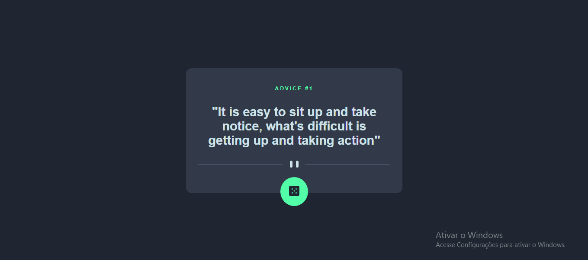
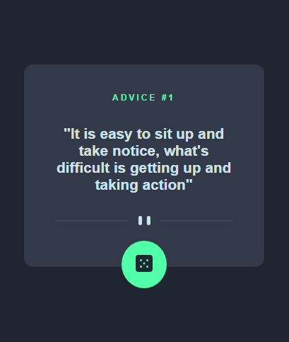

# Frontend Mentor - Advice generator app solution

Essa é uma solução para o [Advice generator app challenge no Frontend Mentor](https://www.frontendmentor.io/challenges/advice-generator-app-QdUG-13db). Os desafios do Frontend Mentor ajudam você a melhorar suas habilidades como programador criando projetos realistas.

### O desafio

usuários devem ser capazes de:

- Ver o layout ideal para o site, dependendo do tamanho da tela do dispositivo
- Ver os estados de foco para todos os elementos interativos na página
- Gerar um novo conselho ao clicar no ícone do dado

## Screenshots

desktop design

mobile design

## Links

[Solução do projeto](https://www.frontendmentor.io/solutions/advice-generator-com-api-v9S1bHEWYf)

[Site na net](https://advice-generator-5o7144dcd-marvin1423.vercel.app/)
## O que eu aprendi
trabalhei as minhas habilidades com API's e trabalhei minhas habilidades com layouts responsivos
## Autor
- Github - [Marvin1423](https://github.com/Marvin1423)
- Frontend Mentor - [@Marvin1423](https://www.frontendmentor.io/profile/Marvin1423)
